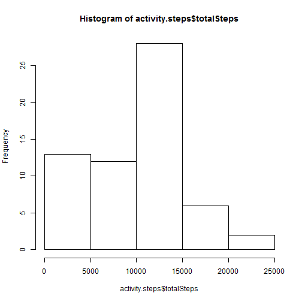
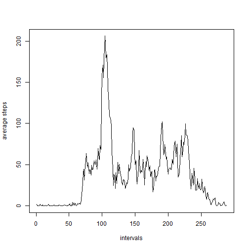
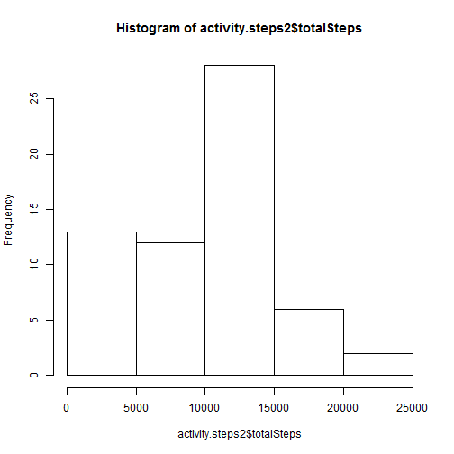
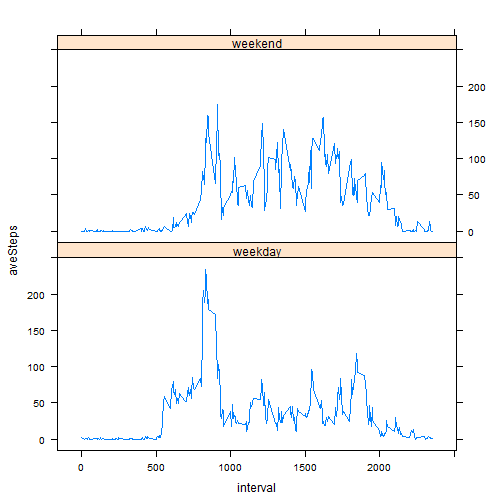

# Reproducible Research: Peer Assessment 1


## Loading and preprocessing the activity

```r
library(plyr)
```

```
## Warning: package 'plyr' was built under R version 3.0.3
```

```r
library(data.table)
```

```
## Warning: package 'data.table' was built under R version 3.0.3
```

```r
activity <- fread("./activity.csv")
summary(activity)
```

```
##      steps           date              interval   
##  Min.   :  0.0   Length:17568       Min.   :   0  
##  1st Qu.:  0.0   Class :character   1st Qu.: 589  
##  Median :  0.0   Mode  :character   Median :1178  
##  Mean   : 37.4                      Mean   :1178  
##  3rd Qu.: 12.0                      3rd Qu.:1766  
##  Max.   :806.0                      Max.   :2355  
##  NA's   :2304
```

```r
activity.steps <- ddply(activity,.(date),summarize,totalSteps=sum(steps,na.rm=TRUE))    
hist(activity.steps$totalSteps)
```

 

## What is mean total number of steps taken per day?

```r
mean(activity.steps$totalSteps,na.rm=TRUE)
```

```
## [1] 9354
```

```r
median(activity.steps$totalSteps,na.rm=TRUE)
```

```
## [1] 10395
```

## What is the average daily activity pattern?

```r
activity.aveStepsIn5Mins <- ddply(activity,.(interval),summarize,aveSteps=mean(steps,na.rm=TRUE))
ts.plot(activity.aveStepsIn5Mins$aveSteps,gpars=list(xlab="intervals",ylab="average steps"))
ts.plot(activity.aveStepsIn5Mins$aveSteps,gpars=list(xlab="intervals",ylab="average steps"))
```

 

```r
activity.aveStepsIn5Mins[max(activity.aveStepsIn5Mins$aveSteps),]
```

```
##     interval aveSteps
## 206     1705     56.3
```
## Imputing missing values

```r
sum(is.na(activity$step))
```

```
## [1] 2304
```

```r
activity2 <- copy(activity)
activity2$temp <- ifelse(is.na(activity2$steps),0,activity2$steps)
activity2[,newSteps:=mean(temp),by=date]
```

```
##        steps       date interval temp newSteps
##     1:    NA 2012-10-01        0    0        0
##     2:    NA 2012-10-01        5    0        0
##     3:    NA 2012-10-01       10    0        0
##     4:    NA 2012-10-01       15    0        0
##     5:    NA 2012-10-01       20    0        0
##    ---                                        
## 17564:    NA 2012-11-30     2335    0        0
## 17565:    NA 2012-11-30     2340    0        0
## 17566:    NA 2012-11-30     2345    0        0
## 17567:    NA 2012-11-30     2350    0        0
## 17568:    NA 2012-11-30     2355    0        0
```

```r
activity.steps2 <- ddply(activity2,.(date),summarize,totalSteps=sum(newSteps,na.rm=TRUE))    
hist(activity.steps2$totalSteps)
```

 

```r
mean(activity.steps2$totalSteps,na.rm=TRUE)
```

```
## [1] 9354
```

```r
median(activity.steps2$totalSteps,na.rm=TRUE)
```

```
## [1] 10395
```


## Are there differences in activity patterns between weekdays and weekends?

```r
Sys.setlocale("LC_TIME", "C")
```

```
## [1] "C"
```

```r
activity2$date <- as.Date(activity2$date)
activity2[,weekday:=weekdays(date)]
```

```
##        steps       date interval temp newSteps weekday
##     1:    NA 2012-10-01        0    0        0  Monday
##     2:    NA 2012-10-01        5    0        0  Monday
##     3:    NA 2012-10-01       10    0        0  Monday
##     4:    NA 2012-10-01       15    0        0  Monday
##     5:    NA 2012-10-01       20    0        0  Monday
##    ---                                                
## 17564:    NA 2012-11-30     2335    0        0  Friday
## 17565:    NA 2012-11-30     2340    0        0  Friday
## 17566:    NA 2012-11-30     2345    0        0  Friday
## 17567:    NA 2012-11-30     2350    0        0  Friday
## 17568:    NA 2012-11-30     2355    0        0  Friday
```

```r
activity2[,day:=ifelse(weekday %in% c("Saturday","Sunday"),"weekend","weekday")]
```

```
##        steps       date interval temp newSteps weekday     day
##     1:    NA 2012-10-01        0    0        0  Monday weekday
##     2:    NA 2012-10-01        5    0        0  Monday weekday
##     3:    NA 2012-10-01       10    0        0  Monday weekday
##     4:    NA 2012-10-01       15    0        0  Monday weekday
##     5:    NA 2012-10-01       20    0        0  Monday weekday
##    ---                                                        
## 17564:    NA 2012-11-30     2335    0        0  Friday weekday
## 17565:    NA 2012-11-30     2340    0        0  Friday weekday
## 17566:    NA 2012-11-30     2345    0        0  Friday weekday
## 17567:    NA 2012-11-30     2350    0        0  Friday weekday
## 17568:    NA 2012-11-30     2355    0        0  Friday weekday
```

```r
activity2.aveStepsIn5Mins <- ddply(activity2,.(interval,day),summarize,aveSteps=mean(steps,na.rm=TRUE))
library(lattice)
```

```
## Warning: package 'lattice' was built under R version 3.0.3
```

```r
activity2.aveStepsIn5Mins <- transform(activity2.aveStepsIn5Mins,day=factor(day))
xyplot(aveSteps~interval|day,data=activity2.aveStepsIn5Mins,layout=c(1,2),type="l")
```

 
